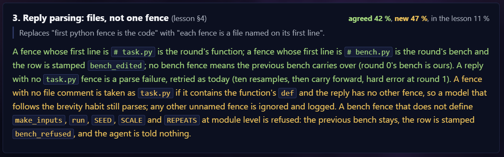
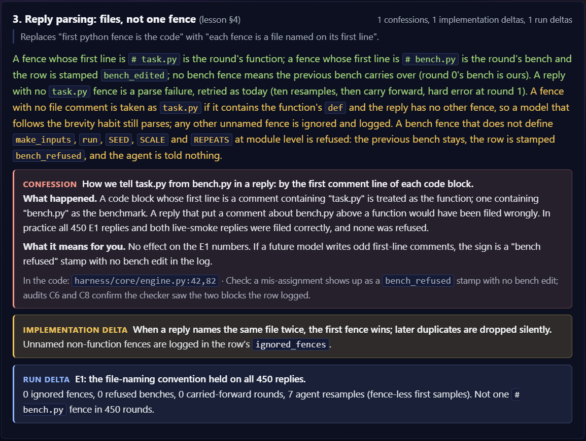

# Sector


In 1 sentence: Sector is an agentic-engineering workflow that tells your LLM agent: "not just execute the next prompt, but also ensure that your work is a) easy to understand b) easy to verify c) engaging enough to keep the user in the driver's seat".

In 4 bullets, Sector is based on the following principles, from most to least obvious:

1. Help the agent understand **what you want**:
   - Goals, what good looks like, preferred level and style of explanation
2. Make the agent's work itself understandable, and **easy to verify**:
   - Plan out the task → agent implements → *shows* the result (not just reports about it) and *confesses* about ad hoc choices
3. Next session **remembers** everything:
   - All proofs of work are traceable back to the producing code & commits; new agents get quickly on board with previous work
4. **Be pro-active**: choose additional ways to understand and participate:
   - Lessons, games, hands-on contributions and visual navigation as your dopamine savers

> **Doing research?** Sector started as a research workflow; read [TO_RESEARCHERS](docs/TO_RESEARCHERS.md) first.

The main principle: **you only take what you need** (with your setup agent helping you understand & choose what you need). Sector is multi-level (each level 1-4 corresponding to one of the above principles) and earlier layers don't depend on later ones. So it can be as lightweight as 1 additional block in your AGENTS.md (or CLAUDE.md) file, or as big as a whole eco-system of linked artifacts, that makes planning and verifying tasks much easier. Everything is template-based and customizable: each level only defines a shape and default templates, which you're free to adjust for your specific preferences.

## Quick start

If you're in a rush, just feed your LLM the `docs/agent/AGENT_README.md` file and it will give you a personalized walkthrough to decide what specific implementation of Sector to adopt. But I'd recommend reading the rest of this post first if you want to make the most informed decisions on what to take from here or not.

To get the agent's walkthrough, add Sector to your repo as a submodule:

```bash
git submodule add https://github.com/TarasKutsyk/Sector tools/sector
```

Which way to add it:

- **Your own repo:** the submodule above. Sector stays updatable with `git submodule update --remote`.
- **A team repo where you want Sector private:** use `git clone https://github.com/TarasKutsyk/Sector tools/sector` instead, so the team's `.gitmodules` stays untouched, and see the FAQ.
- **Only Level 1:** either way works. Setup copies the few files you need into your repo and then offers to remove Sector's folder, so nothing of Sector stays behind.

Then tell your agent:

> Read tools/sector/docs/agent/AGENT_README.md and set up Sector in this repo. [Optionally, briefly describe your intended use case.]

After setup, the first thing worth tuning is Level 1: the owner and project blocks in your rules file, plus `PROJECT.md`. In my experience they give the most impact per line in all of Sector.

Once you've tried it, I'd love to hear how it went: [this 1-minute form](https://tally.so/r/dWrgVD).

## Level-1. Help the agent understand what you want

This is the most basic and lightweight layer motivated by the following observation. Most novice LLM users make two kinds of basic mistakes:
- they don't provide enough context for "what good looks like" or "how to talk to them without overloading"
- or provide too much context, micromanaging the agent in things it would have figured out by itself
Both often result in wasted time: either on the stage of defining/planning the task, or refining the result (or both).

Fix that the Sector proposes: **Help the agent help yourselves!** Not much is really needed for that: you just add the following two blocks to your AGENTS.md file:
-  **Owner's block**:
	- Who I am and what I care about most
	- What I want to understand/decide in the process, and at what level (methodology, architecture, code)
	- How to talk to me (style, length, what bores me)
- **Project block**
	- high-level goal(s), non-goals
	- (optional) constraints and acceptable trade-offs
	- (can be factored out in a separate `PROJECT.md` for easier editing as the project evolves)

By default, the agent asks when your goal is unclear and flags conflicts with goals or constraints you’ve already stated. During setup, you can also ask it to suggest priorities and alternative directions (e.g. if you're new to some area), resulting in a workflow like this
```
Given: user preferences/goals + current request
                 ↓
- If clear: the agent judges the current request against both
    -> If the goals align, proceed; otherwise suggest one highest-value adjustment
                 ↓
- If not clear AND the answer would materially improve the result
    -> Stop and clarify with the user in a brief and easy to answer way
```
(you can opt into this during setup and edit the workflow as you wish)

The net effect is that the agent doesn't have to guess (as much) and make choices you later have to undo, and it also helps you to stay on track towards your goals and not overextend (which is exactly what helped me with my perfectionism, the desire to "do everything" and the resulting ["AI Brain Fry"](https://carlhendrick.substack.com/p/ai-brain-fry-workslop-and-the-ironies)).

And the personalization layer is important too: you can make agents respond in a much more human-readable style (e.g. check [Cursor's UNSLOP skill](https://github.com/cursor/plugins/blob/main/pstack/skills/unslop/SKILL.md)), ensure you're always following along, and in general care about things besides just "implement the next prompt" (or at least to make it seem like they care).

## Level-2. Make the agent's work itself understandable, and easy to verify

```text
   PLAN ----------------->   BUILD
     -> interview              v 
     -> verification
     -> what good looks like | REPORT: the final phase of the build, never skipped
                             |    the plan's walkthrough + the deltas
                             |    + proof the owner can look at
                             v
   [next PLAN] <---- [optional: lessons, games, ship]
```

Well-readable responses are not enough: most of the time the agent implements too many things to be able to report everything faithfully in chat. And reviewing the raw agent's work (code files, long-running experiments) can be even harder than doing the work yourself -- so what do we do?

**Key idea**: move the cognitive load to the planning stage -- BEFORE the task is implemented. It's much more intuitive to review something when you already have a crisp mental model of it. And you often don't need to review *everything*: if you know that the quality of the results can be mostly defined by a few compact artifacts (e.g. UI screenshots, or the values of key metrics in your business/research) -- you just look at the artifacts! That's what I mean by "verification" in this repo: ability to tell that the agent's work is good from a few *proofs of work* or *artifacts*, like in the examples above.

This is why the well-known *planning operation* is the heart of Sector: process of refining your understanding of the task into a form that later *facilitates* easier review and verification. Whenever you prompt the agent to implement a (hard enough) task,
1. You think through the key implementation/design choices step by step, in multiple "interview rounds" ([inspired by Matt Pocock's grilling skills](https://github.com/mattpocock/skills))
2. At each round, the agent asks you only what you can answer/decide at that point, providing you with all the necessary context
3. At the end (or in the process) you also decide on what the proofs of work should be (screenshots/videos/tests/metrics), and how they should look like in the end (e.g. video or tests showing that the feature works exactly how you specified it)
4. The agent takes your input and turns into a structured task specification (as a nice html page, by default), that you can further refine if needed

Several important things make it less scary and user-demanding than it first sounds:
- A. The plan's structure is not rigid: the only required thing is that you answer at least some questions central to the task, and define in at least one phrase "what good looks like" (the agent can then propose its own proofs of work and the plan's "done" criteria)
- B. The resulting plan specification is written in different colors, so that you know what to focus on. Neutral/green denote steps that you've already discussed and locked in during the interview rounds; amber denotes the new things that the agent added to fill in the gaps. Here's an example from my real project (just check for the visuals)



- C. You think more during planning to *think less during review*. The review becomes as easy as reading *a report* -- companion file that's fully based on the plan you're already familiar with, with all the changes/implementation-time choices flagged by the agent in eye-catchy boxes, as in the example below



Those boxes are referred to as "implementation deltas": something that the agent decided or obtained during implementation (that wasn't in the plan). The most risky decisions (according to the agent) are flagged as "Confessions" (red box), and this is #1 thing that helps me catch bugs or various misalignments from my initial intent (the plans can't be perfect!). There are also more routine deltas (yellow box) or run deltas (blue) -- things from the actual code/experiment runs you should know about.

But how can you tell that the agent is completely honest, i.e., its reported deltas are faithful to what's actually implemented, and it didn't miss anything important? And this is what the next layer exists for.

## Level-3. The repo knows its where-s and why-s

Working with LLMs often automates some repetitive/boring things only to replace them with other boring things: loading all of the context/data into the current chat, stitching together various pieces to review them with another LLM etc. This is generally referred to as "context engineering" and it's really become something you must get good at for complex enough tasks. **This Sector level essentially killed most of the context-engineering** for me. Loud claim, so here's how.

First step, save the plans and reports from Level 2 on disk under a separate `.sector` folder. The plan-report pairs that share the same topic (e.g., work on the same part of the website) go into the same folder -- together they form a *workstream* or a Sector *branch*. And remember that each report comes with proof-of-work artifacts (defined by the corresponding plan), which are also natural to save in the same branch (close to the reports). So we need to somehow turn this disordered collection of files into a single coherent story.

This is what a *branch card* exists for: one `.md` file per workstream that's maintained by the agents and summarizes its latest status, the results chain (based on the reports) and other things that would be useful to know for the fresh agents. All together, a single branch looks like this on your disc:

```text
.sector/workstreams/accounts/
|
+-- plans/
|   +-- 2026-09-10_login-plan.html
|   +-- 2026-09-11_password-reset-plan.html
|
+-- reports/
|   +-- 2026-09-10_login-report.html
|   +-- 2026-09-11_password-reset-report.html
|
+-- artifacts/
|   +-- login/
|   |   +-- screenshot.png
|   |   +-- tests.txt
|   |   +-- walkthrough.html
|   |
|   +-- password_reset/
|       +-- screenshot.png
|       +-- tests.txt
|
+-- ACCOUNTS.md  <- branch card
        |
(inside the card)
        |
        v
---
required_context: [env.local, style.frontend]  # shared context to read
live_docs:                                     # current plans, reviews, proofs
  - plans/2026-09-11_password-reset-plan.html
  - reports/2026-09-11_password-reset-report.html:
      - artifacts/password_reset/screenshot.png
      - artifacts/password_reset/tests.txt
      - artifacts/password_reset/walkthrough.html
  - plans/2026-09-10_login-plan.html
  - reports/2026-09-10_login-report.html:
      - artifacts/login/screenshot.png
      - artifacts/login/tests.txt
      - artifacts/login/walkthrough.html
check-me:                                      # main proofs of work
  - artifacts/password_reset/screenshot.png
  - artifacts/password_reset/walkthrough.html
# ... other metadata
---

## Goal            # what this branch should achieve
## Now             # where things stand today
## Working Claims  # what works, with links to evidence
## Landmines       # mistakes and constraints to remember
## Graveyard       # ideas we dropped, and why
```

Remember that everything here (except for the `## Goal` section) is maintained by the agents, so ~95% of the time you don't need to edit any of this stuff (the contents are generated based on your chats and planning sessions with the agents). It's also not the same as the code docs, so maintenance is much easier: it basically gives a chronological order of your agentic session outputs, with the outputs that are still relevant shown in `live_docs` section (whenever something goes stale, you remove it from the `live_docs` and optionally add a graveyard note). So it's not like a live documentation layer that risks becoming desynchronized with the actual implementation, and more like "here is what currently matters for this workstream" foothold.

And this is where it pays off: instead of orienting your fresh agents from scratch, you just point them at the branch card, saying things like
> We're in @ACCOUNTS.md, let's continue from the latest report. I now want to implement something similar but for...

and the agent immediately gets into the latest relevant work via `live_docs` (and loads any other `required_context` like environment facts, if you provide one in your `.sector/core` folder), understands the current goal, what worked and what didn't etc. This basically makes you independent from previous chat histories and removes most of repetitive context-engineering, allowing to quickly spawn fresh agents with the exact shared context you need.

What is arguably even more important, at least in research, is **traceability** (which answers the honesty question from Level 2). Every claim the agent makes in a report points at an artifact saved in the branch, and every artifact comes with a reproduction record (the full commit ID it was produced at, a saved patch for anything uncommitted, and the command to rerun it). So when a result or a Confession looks off, you don't have to take the agent's word for it: you open the artifact, see how it was produced and inspect the underlying code if needed.

Of course, at some point this workstream layer can become messy (as the number of workstreams and their complexity increases), and this is why Sector comes with its **Sector-Starmap UI component.** It's described here in [a separate ReadME](docs/STARMAP.md), and the demo below shows the main things it helps with:
- Orient yourself inside a workstream and between different workstreams
- Quickly find artifacts you need
- Create fresh prompts for new sessions (by stitching together specific context from different workstreams and personal `.core` files)

[](https://youtu.be/3CTNLCrJHEs)

## Level-4. Be pro-active: choose additional ways to understand and participate
> You can outsource your thinking, but you can't outsource your understanding.  
   (C) Andrej Karpathy  
  
This last level is meant to support a single idea: *something has to happen between* the iterative "plan -> implement -> review" sessions. Otherwise, you can often end up in various kinds of *debts*:  
- **Cognitive debt:** your code base develops faster than your mental model of it. More generally, you no longer think as deeply about the way your project develops, and lose ability to judge what is the best thing to do at any given step. This makes you more and more reliant on agents' judgements (which often become unreliable starting from a certain scale), and increases the risk for you to simply get stuck at a certain point.  
- **Implementation debt:** as your code base grows across many sessions, things get ugly because each session's agent is not inherently interested in keeping the code as nice and future-proof as a human would do it. So over time, it becomes harder and harder both for you and your future agents to implement things correctly and efficiently  
  
The good news is: mitigating the debt is possible and can actually be quite fun! Programmers had been successful in this for many years by simply doing what they enjoyed: methodological, bottom-up, what Matt calls ["tactical" work](https://x.com/mattpocockuk/status/2057110441864696164) (like solving low-level puzzles instead of constant strategic planning). So one natural way to reduce the debt is to **integrate some part of this tactical element** into our agentic-engineering workflow.  
  
This is how Sector implements it: in-between the usual planning and review ops, we insert other optional ops that I divide into two categories:  
- **games**: quiz-like or challenge-like elements that make you more engaged with the code base and reward you for that with scores and personal-record tracking. Naturally, engaging with the code base requires a deeper understanding of it & the underlying stack, so this is why we also have...
- **lessons**: textbook-like html documents that either explain some key technical concepts underlying the implementation, or just walk you through the code at low level. My favourite concept I adopted here from [Simon Willison](https://simonwillison.net/) is a ["linear walkthrough"](https://simonwillison.net/guides/agentic-engineering-patterns/linear-walkthroughs/): a detailed, step-by-step, agent-generated explanation that walks you all the way from the inputs of your program to the outputs. This is the main way how I usually manage my cognitive and implementation debts with Sector, and I provide [a specific template for your agents to implement it](templates/addons/lessons/linear_walkthrough.md)

Here's how it fits in a single diagram with the rest of Sector, along with more examples of games/lessons:

```text
PLAN -----------------> IMPLEMENT  
 -> discussion/interview   |      
 -> plan doc               v           
    ^                REPORT-REVIEW <---|          
    |                      |           |    
    |                      |-- Fix bugs/issues               
    |                      |               
    |                      |               
    |                      v
    |                   LEVEL 4
    |                      |
    |                      v 
[next PLAN] <----   [Reduce cognitive debt]
    |              -> lessons: have an LLM teach you how a thing is implemented
    |              -> games: spot deliberate flaws in LLM explanations;
    |                        write some bounded function better by yourself;
    |                        ...
    +-------------- [Reduce implementation debt]
                   -> lessons: have an LLM draw the current architecture
                               and (optionally) refactoring proposals
                    -> games: design a highest-taste combination of the
                             refactoring proposals, and/or your own ideas
```

---

A natural follow-up question "but how do I know when to play which games?" leads us to the last Sector principle: **learn to be pro-active with agents**. No workflow or harness can force you to maintain your understanding or keep enjoying things -- it's *your natural right* to do! Sector just reminds you about that and offers a menu of options to achieve that, like specific [lesson and game templates](templates/addons/README.md). But at the end, you have to decide at the moment what is the main thing you're currently lacking (understanding a new module, learning a technical concept, code architecture polish etc.) and choose the corresponding game or lesson accordingly (with optionally enabled agent suggestions to help you pick a specific option). 

My rule of thumb is just listening to what your inner self wants and not be hesitant to make it part of the agent's work. Say, you got tired of planning but have to finish the implementation ASAP: just tell the agent to ask you only as many questions as you can answer in (say) under 5 minutes, otherwise using agent's recommendations. Or if you got tired of planning, but don't have to finish ASAP, go on and tell the agent that you'd like to code a key module or function by yourself, and let the agent do the remaining boilerplate work. The key thing is **not being afraid of a temporary slowdown** of your progress, because this temporary slowdown will enable you to stay consistent long-term and avoid much more serious and long-lasting slowdowns in the future, that [people already experience](https://carlhendrick.substack.com/p/ai-brain-fry-workslop-and-the-ironies).

# So how do I use it after setup?
[Setup can include many combinations of the levels above, so I'll assume the full one with Levels 1-4]

A reasonable worry is that Sector adds a lot of mental and implemenetation overhead. I address the implementation overhead in the [FAQ](#faq), and here focus on the mental part -- what you specifically have to hold in your head. Turns out, not that much: 
- Plan sessions start automatically on every major implementation request
  - Unless it's a minor refinement/bug-fixing of existing implementation, then the agent just operates normally
- Once the agent implements something, it automatically updates the branch card and walks you through the new report/proofs of work 
- Games are suggested automatically (by default, unless you disable it)

So basically, the only thing you have to remember is "where a thing lives in Sector" in case you need it later (e.g. next planning session). Descriptive artifact names help here (dates are added to the names by default for easy sorting), and you can always open the starmap to find things easier (visually, or via in-sector search with Ctrl + P). Lastly, you can always ask the agent "I remember we did X, where is it in Sector?" -- works suprisingly well even for vague requests in my experience.

And it's also perfectly fine to skip some Sector ceremony if you're in a rush (I do it myself too). The basic way is to put `SECTOR-OFF` flag anywhere in your prompt, turning Sector off for this & subsequent prompts until you type `SECTOR-ON` again. Alternatively, if you say something like "I only have 5 minutes to plan & launch this", the agent will only ask you 1-3 most important implementation-changing questions. Reading full reports is not necessary too if you can judge the work from 1-2 main proofs of work (although I'd still recommend checking top Confession blocks), and games are optional. So in practice, **you don't really lose any speed when it's important**. Only when you have enough time, on the most central parts of the project, where it's most reasonable to slow down, plan carefully and understand the agent's work better -- that's where you can benefit the most from Sector.

# But does this actually work?

Here's my honest summary:
- As of the launch date, I'm the only person who's been using Sector for around 6 months now -- getting feedback from others is one of the main points of this launch ([the form](https://tally.so/r/dWrgVD))! Initially I created it for my programming-heavy research projects in AI-Safety and Interpretability (like [this one](https://arxiv.org/abs/2607.03640)), but soon successfully applied it also for my personal productivity app (in development & maintenance for 3 months now)
- I can therefore vouch for how things work in **1-person projects developed from scratch over a period of 3 to 12 months, using frontier OpenAI and Claude models throughout**; how it stands in multi-person, commercial-scale repos is one of the yet-unknown things I'm curious to learn about! (see the FAQ section on my initial thoughts)
---
- **Levels 2 and 3** (`plan -> review` loop with the underlying `.sector` ecosystem of notes) are the ones that I have most confidence in: they existed right from Sector's seed and have been tremendously useful in helping me plan & successfully execute complex experiments, also when under time pressure (so the "minimal overhead" part is tested too). It also kept my research progress (ideas, code, experiment results) well-organized and easy to build on. 
- **Level-1** is a more recent addition. Explicit owner preferences and project goals did help me to avoid repeating same instructions across prompts. I also use the optional mode where the agent suggests priorities and questions my direction; whether that's helpful or annoying will depend on your agent and preferences.
- **Level-4**: least tested part. I do believe in it as one of the most future-proof ideas of Sector, but the implementation of it is probably far from ideal. I've mostly tested lessons in forms of walkthroughs and the [sabotage hunt](templates/addons/games/sabotage_hunt.md) and [Check My Summary](templates/addons/games/check_my_summary.md) games played on top of them to capture the obtained understanding (and I've been enjoying it); the other options I provide in game-templates folders are basically idea sketches, and to-be refined with my & your future feedback.

---

# FAQ

**Which agents and systems is it compatible with?**
I've tested Sector with Claude Code and Codex, on Windows. Any agent that reads an `AGENTS.md` or `CLAUDE.md` file should work as well, since Sector is only instructions and templates, but other agents are untested, and so are macOS and Linux.

**Which languages and project types does it support?**
Any, since everything Sector adds is Markdown and HTML. The only code is the validator and the optional Starmap module: a small local server that draws your `.sector` folder as a map in the browser. Both need Python 3.10+ with PyYAML (`pip install pyyaml`).

**Will sector work fine with local/weaker models?**
Not guaranteed, but it depends on your workflow. For long autonomous runs where the agent iterates against a stated goal without much guidance, I'd strongly suggest using the latest available frontier model. However, you can probably do fine with much weaker models if you put more time into planning sessions and develop detailed enough specs, so that there is less room for error. Keep in mind though that weaker models also lose context more easily, so they may eventually forget Sector-specific instructions.

**Is there a recommended model for Sector?**
Yes, my preferred ones are usually latest Claude models. Without fan-boy rambles, one specific feature that works awesome with Sector is Artifacts: you ask Claude to host a given plan html as artifact, and you can very neatly refine it via Comment functionality (by selecting and giving feedback on specific snippets).

**What about a shared team workflow?**
I haven't tried Sector with a team yet, and my hunch is that for most workflows it's best to keep private: a lot of context is personalized, and you always know what's in a branch instead of having to check for team updates all the time.

**So how do I use Sector privately in a team repo?**
Keep everything Sector-related out of git by listing it in `.git/info/exclude` (git's local-only ignore list) rather than in the team's `.gitignore`: the `.sector` folder, `sector-map.config.json` and `.sector-map.local.json`. The Sector package goes there too: instead of adding it as a submodule (which changes the team's shared `.gitmodules`), clone it with `git clone https://github.com/TarasKutsyk/Sector tools/sector` and exclude `tools/sector/` as well. Then there are two cases:
- **Your team has no `AGENTS.md` or `CLAUDE.md` of its own:** easy life, you just git-ignore your AGENTS/CLAUDE.md the same way as above.
- **Your team has one:** leave it untouched and put the Sector instructions into a personal file instead. In Claude Code that's a `CLAUDE.local.md` (excluded too); if the team's file is `AGENTS.md`, start your `CLAUDE.local.md` with the line `@AGENTS.md`, because otherwise the local file stops Claude from reading theirs. Codex has no additive local file, so use an `AGENTS.override.md` at the repo root that holds the team's `AGENTS.md` plus your Sector block, and re-copy the team's part when it changes. For other agents, check how yours loads personal project instructions.

**Do I need the map?**
No, all levels work without it. But it's nice and pays off once your workstreams outgrow your head ;) ([docs/STARMAP.md](docs/STARMAP.md))

**What exactly does setup change in my repo?**
Only what you choose. Level 1 adds one rules file (`AGENTS.md` or `CLAUDE.md`, or a block appended to yours) and a `PROJECT.md`; Levels 2 and 3 add the `.sector` folder with your first workstream, a `sector-map.config.json`, two `.gitignore` lines and Sector itself as the `tools/sector` submodule; games and lessons add their templates under `.sector/templates/addons/`. If you only take Level 1, setup offers to remove the submodule at the end, since everything you use is already copied into your repo.

**Doesn't it add a lot of overhead?**
The main implementation overheads are reports/artifacts generation and card updates. Both are minuscule fractions of big tasks (exactly ones you'd want to have good reports on). And in quick iterative sessions, where you just want to fix an existing result, the agent skips the planning and book-keeping on its own (or you can force it with `SECTOR-OFF`).

**Does it work with my existing skills?**
Sector is instructions plus templates, so skills should coexist. Setup appends to your existing rules and never rewrites them, and it walks you through any conflicts first.

**Will you maintain it?**
Only lightly: I'll push my own fixes here from time to time and look at the issues roughly once a month, without promising more. What I'd love is something like 3Blue1Brown's Manim, where a community maintains a public fork while the author keeps his own version; if you'd like to help with that, or just want to tell me how Sector worked for you, please fill in [this form](https://tally.so/r/dWrgVD).

---

# What's in the repo

```text
AGENTS.md          # seed rules file, copied into your repo at setup
docs/
  agent/           # setup-agent instructions
  STARMAP.md       # the map: usage, then maintainer notes
templates/         # what artifacts look like
  programming/     # plan, report, ship
  research/        # plan, report
  workflow/        # workflow modes: solo, orchestrated
  addons/          # games and lessons
examples/          # owner-fit template, style pack, host configs
atlas.py           # validator
server.py          # map server
src/, dist/        # map frontend (dist/ is prebuilt)
tests/
LICENSE            # MIT
```

Your repo owns its workflow files and config; nothing project-specific lives here.

## The map

Optional UI layer. How to run it and what it does: [docs/STARMAP.md](docs/STARMAP.md).

```bash
python tools/sector/server.py --repo .    # -> http://localhost:8377
```

## Consistency check 
Check that cards, links and proofs are consistent (agents run this themselves):

```bash
python tools/sector/atlas.py check
```

## Develop or improve the map

```bash
npm install
npm run build              # regenerates dist/index.html; commit it with the change
python tests/test_starmap.py
python tests/test_atlas.py
npm run shot               # screenshot QA (SECTOR_PORT=8461 if 8377 is busy)
```

Maintainer notes: the second half of [docs/STARMAP.md](docs/STARMAP.md). Since the package is a submodule, improvements made from any host repo flow back:

```bash
cd tools/sector
git checkout -b feature/<name>
# edit, build, test
git commit && git push
cd ../.. && git add tools/sector && git commit -m "Update sector"
```

Other hosts pick it up with `git submodule update --remote tools/sector`.

## License

MIT, see [LICENSE](LICENSE).
