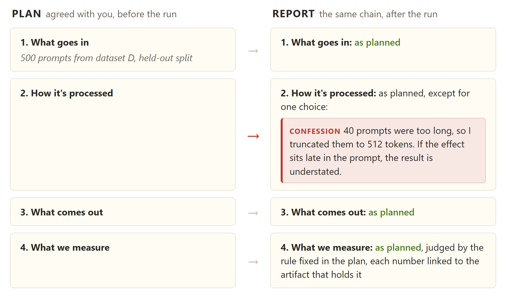
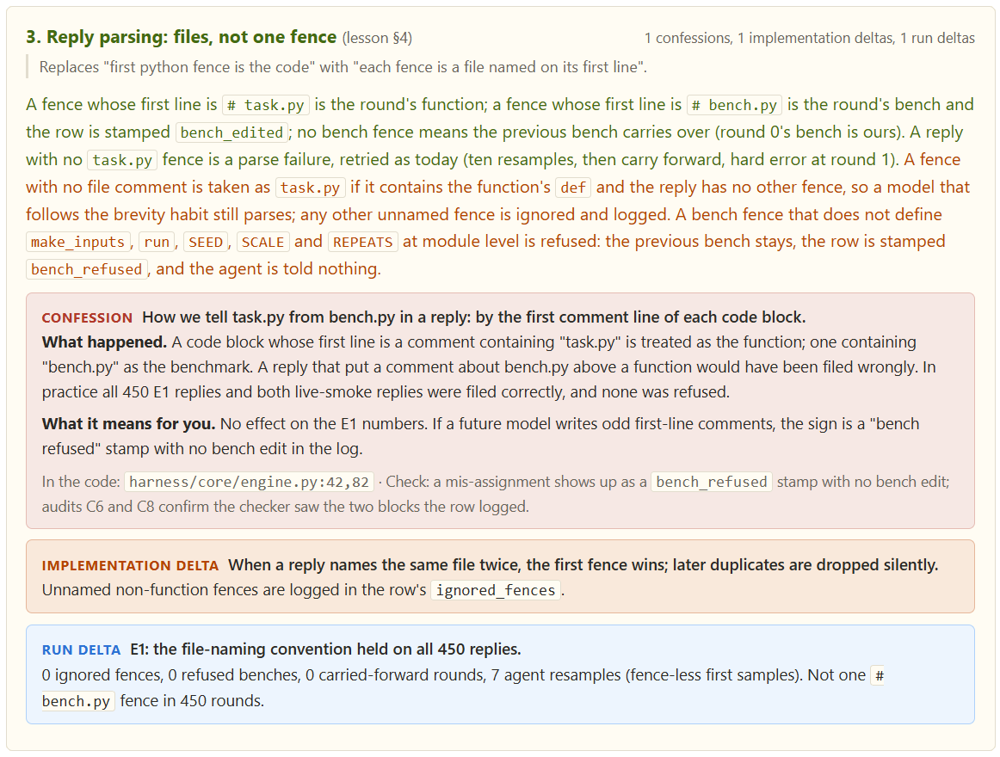
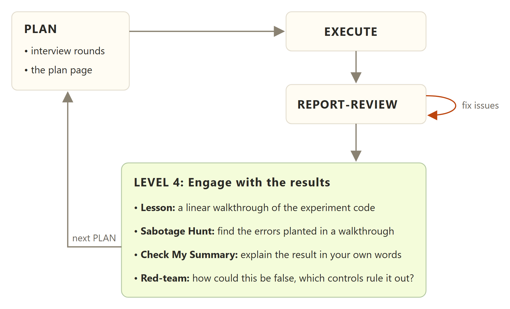

# Sector is research-native
As an AI Safety researcher working with LLMs daily over the last 2 years, I created Sector to avoid very specific failure modes that I'm sure many researchers experience with LLMs too. Maybe such failures convince some of us that LLM-driven research is always slop (in hands-off mode) or takes more out of you than it gives (hands-on mode). But I think I finally converged to a sweet spot between those two modes that may be generally useful to people, so let me walk you through it at a high level; you can find more implementation details in the [README](../README.md).

## Level-1: Agents don't understand what result is good
You ever launched a long-running session, maybe trying to attack a problem from different sides, only to discover 1 day later that all of your agent-obtained results are garbage? One of the main problems is "evaluation lens misalignment": agents often evaluate a result using different criteria than you would. So one of the basic things Sector does:
> Lets you specify "what good results look like" globally, so that agents better understand what specifically you're looking for without you having to repeat it every time.

This may sound obvious or stupid, but this kind of simple specification (as short as 2-3 sentences) has made my long autonomous runs much more fruitful.

## Level-2: Agents make stupid assumptions about your experiments

Even if you're aligned on "what good looks like" on a high-level, many problems are complex enough that tiny details can easily ruin their solutions -- and the agents are often bad at tiny details. The conventional answer is "so write all the code by yourself", but it's not the only solution: **you can think through the tiny details without writing any code**.

This is why planning sessions exist, and unlike native implementations in Claude Code/Codex where agents ask you only the 3-4 most high-level questions, Sector's planning is multi-round (inspired by [Matt Pocock's grilling skills](https://github.com/mattpocock/skills)), and lets you dive much deeper into the experiment design. This results in complete, linear specifications, that you can **also use later to review** the work:

So you don't only see the results, but also a complete methodological chain leading to them, **including all the ad-hoc choices the agent makes** that can invalidate the results. These choice reveals are called Confessions and it's the number one thing that helped me catch methodological problems before it was too late. You can see it as colored boxes on the example below:

The upper part (with colored text) comes from the corresponding plan, and separates the snippets you explicitly confirmed during interview (green) from the ones the agent added on its own (amber), to help you focus on the new parts. The plan also includes other sections that have made my long-running sessions much more effective: experiment-specific evaluation metric, decision gates (e.g. what to do if the metric is low/high), when to stop or iterate further, and so on.

## Level-3: The work and ideas leading to it are never lost
Research involves a lot of book-keeping, and while useful (e.g. to double check your results), it can often get boring enough for us to skip recording important details like what code version (commit ID) produced the current results, what CLI args etc. And it always backfires at the worst moment, e.g. being unable to locate the exact run that produced the headline results when you want to perform a targeted ablation during rebuttal. **Sector does all of this routine book-keeping for you**, in two places:
1. Each report points exactly to how its results (artifacts) were produced: the config, the script, the commit ID and where the output was saved
2. A *branch card* per workstream links the reports that still matter, in order, and records where things stand, what is established (with evidence), the landmines to avoid, and a Graveyard of dead ends with why they died (so a failed idea isn't retried a month later.)

The outcome is that **it becomes much harder for the agent to fool you**. The agent's goal becomes not only to deliver a nice-looking result, but also to provide a full chain behind it: from how it was produced exactly, to how it was judged (against the evaluation scheme locked in the plan), to where it was saved on disk. So you can always replicate a result and review the code behind it (by yourself or with another LLM).[^eval] And the branch card just ensures that all of the important reports & takeaways from them are never lost.

All of this is maintained automatically by your agent, so you can recover the missing state just by prompting like 
> We're in workstream X, check how exactly we obtained figure Y. I want a variant with Z changed...

Building on existing work no longer requires re-explaining the same ideas again (or hoping the agent infers them from bare code):
> We're in workstream X, I now want to run an experiment based on the data we obtained from run Y, using same evaluation lens as in experiment Z

And in case the workstream becomes too big (or too many parallel workstreams pile up), I provide a minimal UI layer, [the Starmap](STARMAP.md), to help you orient yourself:

## Level-4: Staying in the driver's seat

> You can outsource your thinking, but you can't outsource your understanding.  
   (C) Andrej Karpathy  

LLM-assisted research often goes so fast that your head just cannot keep up with all the new results coming in, even with careful planning. Combined with the constant incentive to "run even more comparisons/improve the metric further", you start missing the core research component of critically evaluating *existing* results (how they can be wrong, have you missed something important etc.) This is why Level-4 exists, allowing you to slow down at the right moments and engage with the results on proper level of detail.

Sector incentivizes this engagement by letting you **be pro-active** in a few activities, most of them game-like:

- **During review: Sabotage Hunt and Check My Summary.** Instead of reading passively, hunt the errors planted in a walkthrough the agent writes for the game, or explain the result in your own words and get scored against the sources (works great alongside a research log that only you write, which you can incrementally update with new key artifacts + your summaries)
- **When the review surface becomes too big: a lesson.** A [linear walkthrough](https://simonwillison.net/guides/agentic-engineering-patterns/linear-walkthroughs/) of the experiment code, step by step from the inputs to the numbers, grounded in the real code. This is the one I use most.
- **While planning: Queen's Move.** Write the key piece yourself (a function, a notebook cell), agree its checks in the plan, and the agent builds the rest of the experiment around it. Earn score from the #checks passed, minus hints opened.

**Red-teaming a headline result** (inspired by [Neel Nanda's advice on research](https://www.alignmentforum.org/s/5GT3yoYM9gRmMEKqL/p/cbBwwm4jW6AZctymL#Truth%20Seeking)). Not a game, but part of research mode by default: once you've checked the report, the agent offers to **attack the result** together with you, simplest reasons first. How could this be false? What alternative explanations fit the same data? What are the cheapest controls that would rule each one out? The controls you decide are often good next plan candidates.

In one picture, with the review loop from Level 2:

These are selected examples; the full menu (five games and two lessons) is in [the add-ons guide](../templates/addons/README.md).

---

As a result, researching with LLMs became less like a lottery for me and more like a strategic game, where everything is transparent, you always control the state and are rewarded for good decisions and attention to detail.

Back in the [README](../README.md), you can skip the Level sections, which cover the same ground in general terms, and go straight to what this note doesn't: the two-step [Quick start](../README.md#quick-start) (when you run setup, say it's a research project and the agent uses the research templates), [what daily use looks like](../README.md#so-how-do-i-use-it-after-setup), [how well each part is tested](../README.md#but-does-this-actually-work), and the [FAQ](../README.md#faq). And once you've tried it, I'd love to hear how it went: [this 1-minute form](https://tally.so/r/dWrgVD).

[^eval]: Of course, evaluating results is still your final call, but fixing the intermediate evaluation lens allows the agent to *iterate* on the solution within stated constraints like hyperparameter sweeps. This rules out boring failure modes, like something not working because of one misspecified parameter.
